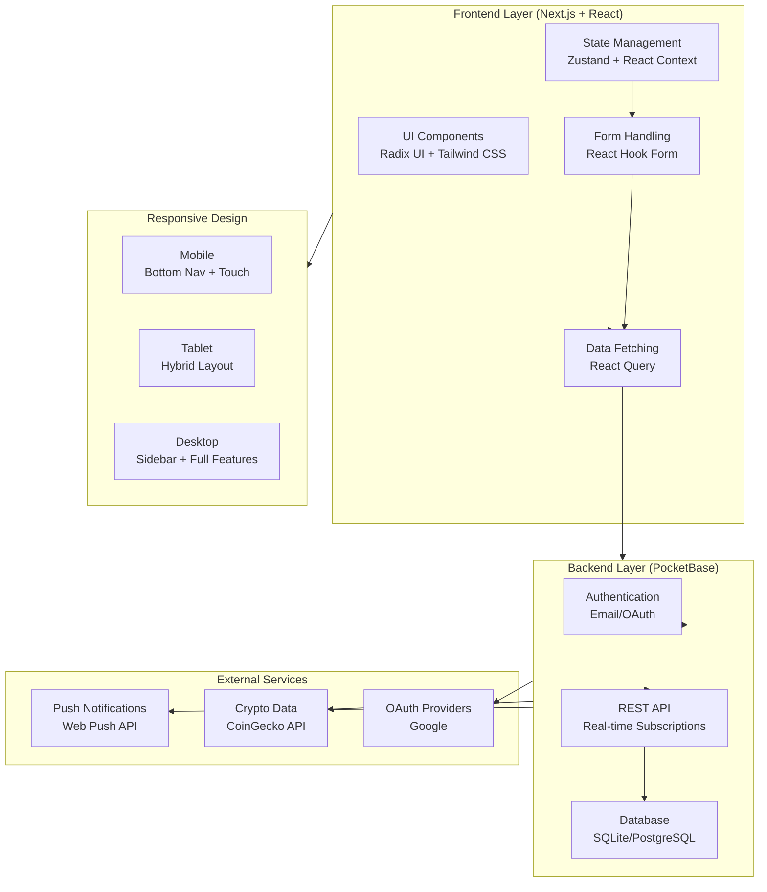
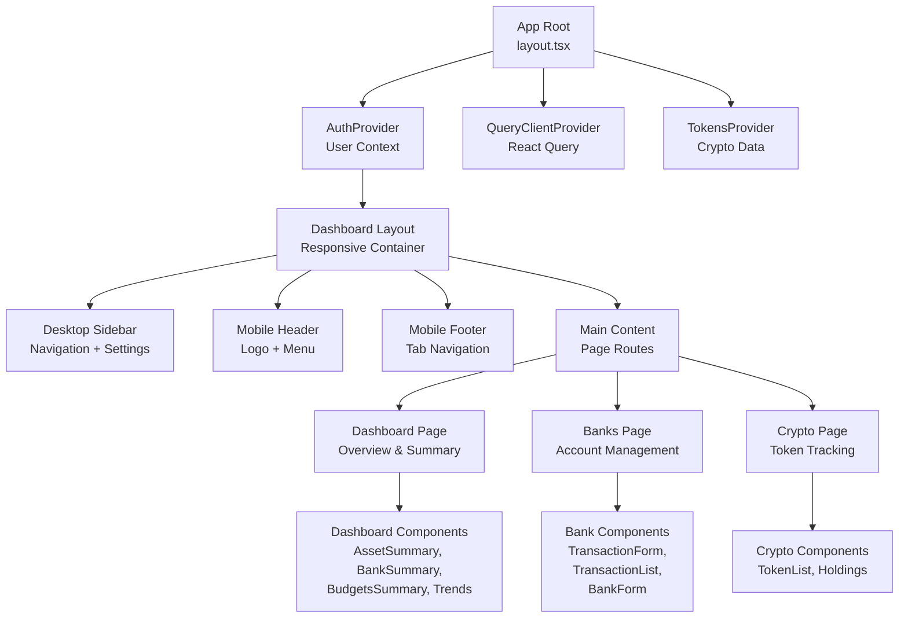

# Design Document: Funds - Personal Finance Tracker

## Overview

Funds is a comprehensive personal finance tracker web application bootstrapped with `create-t3-app` for scaffolding (Next.js, TypeScript, Tailwind CSS). tRPC, Prisma, and NextAuth.js are excluded — PocketBase serves as the backend for authentication, database, and real-time subscriptions, accessed directly from the client via its SDK. It enables users to manage multiple bank accounts, track transactions across categories, monitor cryptocurrency holdings, set budgets, and receive notifications for planned transactions. The application is designed as a Progressive Web App (PWA) with mobile-first responsive design, supporting seamless experiences across smartphones, tablets, and desktops.

The architecture prioritizes real-time data synchronization, offline-first capabilities, and responsive UI patterns that adapt to different device sizes while maintaining consistent functionality and data integrity.

## Architecture



## Component Hierarchy & Data Flow



## Responsive Design Strategy

### Mobile (< 768px)
- **Navigation**: Bottom tab bar with 4 primary sections (Dashboard, Banks, Crypto, Settings)
- **Header**: Fixed top bar with logo, privacy toggle, and menu dropdown
- **Layout**: Single column, full-width content
- **Touch**: Optimized touch targets (min 44px), swipe gestures for navigation
- **Forms**: Full-width inputs, stacked layouts, bottom sheet modals
- **Charts**: Responsive sizing, touch-friendly interactions

### Tablet (768px - 1024px)
- **Navigation**: Hybrid approach - collapsible sidebar or tab-based
- **Layout**: Two-column layout for transaction lists and details
- **Sidebar**: Compact sidebar (176px) with icon + text labels
- **Forms**: Multi-column layouts where appropriate
- **Charts**: Larger viewports for better data visualization

### Desktop (> 1024px)
- **Navigation**: Fixed sidebar (240px - 240px XL) with full navigation
- **Layout**: Multi-column layouts, side-by-side panels
- **Sidebar**: Full-width with expanded labels and icons
- **Forms**: Optimized multi-column forms
- **Charts**: Full-featured interactive charts with legends and controls

## Database Schema & Data Models

### Core Entities

```typescript
// User - Authentication & Preferences
interface User {
  id: string;
  email: string;
  username: string;
  currency: Currency;
  emailVisibility: boolean;
  verified: boolean;
  created: Date;
  updated: Date;
}

// Bank - Account Management
interface Bank {
  id: string;
  user: string;           // FK: User.id
  name: string;
  balance: number;
  primaryColor?: string;
  secondaryColor?: string;
  created?: Date;
  updated?: Date;
}

// Category - Transaction Organization
interface Category {
  id: string;
  user: string;           // FK: User.id
  name: string;
  hideable: boolean;
  total_exempt?: boolean;
  monthly_budget?: number;
  created?: Date;
  updated?: Date;
}

// Transaction - Core Financial Records
interface Transaction {
  id?: string;
  user: string;           // FK: User.id
  description: string;
  type: "income" | "expense" | "deposit" | "withdrawal";
  amount: number;
  bank: string;           // FK: Bank.id
  categories: string[];   // FK: Category.id[]
  date: string;           // ISO 8601 date string
  created?: Date;
  updated?: Date;
}

// Transfer - Inter-bank Transfers
interface Transfer {
  description: string;
  originAmount: number;
  destinationAmount: number;
  originBank: string;     // FK: Bank.id
  destinationBank: string; // FK: Bank.id
  date: Date;
  category?: string[];    // FK: Category.id[]
}

// PlannedTransaction - Recurring Transactions
interface PlannedTransaction {
  id?: string;
  user: string;           // FK: User.id
  description: string;
  type: "income" | "expense" | "deposit" | "withdrawal";
  amount: number;
  bank: string;           // FK: Bank.id
  categories: string[];   // FK: Category.id[]
  recurrence: RecurrenceRule;
  timezone: number;
  previousDate: Date | null;
  invokeDate: Date;
  lastNotifiedAt?: Date;
  active: boolean;
  created?: Date;
  updated?: Date;
}

// Token - Cryptocurrency Holdings
interface Token {
  id: string;
  user: string;           // FK: User.id
  name: string;
  symbol: string;
  coingecko_id: string;
  total: number;
  costAvg: number;
  created?: Date;
  updated?: Date;
}

// PushSubscription - Notification Management
interface PushSubscription {
  id?: string;
  user: string;           // FK: User.id
  endpoint: string;
  keys: {
    p256dh: string;
    auth: string;
  };
  created?: Date;
}

// Currency - Supported Currencies
interface Currency {
  code: string;
  name: string;
  symbol: string;
}

// RecurrenceRule - Planned Transaction Scheduling
interface RecurrenceRule {
  frequency: "daily" | "weekly" | "monthly" | "yearly";
  interval?: number;
}
```

## Frontend Architecture

### State Management Philosophy

**Critical Principle**: Minimize local component state and effects. Use specialized tools for their intended purposes:

1. **React Query**: ALL server state (banks, transactions, categories, tokens, etc.)
2. **React Hook Form**: ALL form input state and validation
3. **Zustand**: ONLY UI state that doesn't fit above (privacy mode, theme, modals, sidebar)

**Components MUST NOT**:
- Store server data in useState
- Duplicate data from React Query in local state
- Use useState for form fields (use React Hook Form)
- Manage loading/error states manually (use React Query)

### State Management

**Zustand Stores**:
- `useAuthStore`: Authentication token and session state ONLY (not server data)
- `useUIStore`: Privacy mode, theme, sidebar state, modal visibility

**React Context**:
- `AuthContext`: User session and permissions (fetched via React Query)

**React Query**:
- Server state caching with automatic invalidation
- Optimistic updates for transactions
- Background refetching for real-time data
- Pagination for transaction lists
- **ALL server data (banks, transactions, categories, tokens, etc.) managed here**

**React Hook Form**:
- **ALL form input state and validation**
- Transaction forms, bank forms, category forms
- No local useState for form fields

### Component Structure

```
src/
├── app/
│   ├── layout.tsx                 # Root layout with providers
│   ├── page.tsx                   # Landing/auth page
│   ├── dashboard/
│   │   ├── layout.tsx             # Dashboard layout (sidebar, header, footer)
│   │   ├── page.tsx               # Dashboard overview
│   │   ├── banks/
│   │   │   └── page.tsx           # Banks management page
│   │   └── crypto/
│   │       └── page.tsx           # Crypto tracking page
│   └── api/
│       ├── cron-planned-reminders/route.ts
│       └── test-notification/route.ts
├── components/
│   ├── ui/                        # Radix UI primitives
│   ├── dashboard/
│   │   ├── AssetSummary.tsx       # Total assets overview
│   │   ├── BankSummary.tsx        # Bank accounts summary
│   │   ├── BudgetsSummary.tsx     # Budget tracking
│   │   ├── CryptoDashboard.tsx    # Crypto holdings
│   │   ├── UpcomingPlannedTransactions.tsx
│   │   ├── SettingsDialog.tsx
│   │   └── banks/
│   │       ├── MonthlyBreakdown.tsx
│   │       ├── CardCarousel.tsx
│   │       └── stats/
│   ├── banks/
│   │   ├── BankForm.tsx           # Create/edit bank
│   │   ├── BankSelect.tsx         # Bank dropdown
│   │   ├── CategoryPicker.tsx     # Category selection
│   │   ├── PlannedTransactionForm.tsx
│   │   └── transactions/
│   │       ├── TransactionForm.tsx
│   │       ├── TransactionCard.tsx
│   │       ├── TransactionFilter.tsx
│   │       ├── TransactionsTable.tsx
│   │       └── TransactionsContainer.tsx
│   ├── CategoryForm.tsx
│   ├── DatePicker.tsx
│   ├── MonthPicker.tsx
│   ├── PrivacyToggle.tsx
│   └── Tabs.tsx                   # Desktop/Mobile tabs
├── lib/
│   ├── types.ts                   # TypeScript interfaces
│   ├── api.ts                     # PocketBase client
│   ├── hooks/
│   │   ├── useAuth.ts
│   │   ├── useBanks.ts
│   │   ├── useTransactions.ts
│   │   ├── useCategories.ts
│   │   ├── useCrypto.ts
│   │   └── useResponsive.ts
│   ├── utils/
│   │   ├── formatting.ts          # Currency, date formatting
│   │   ├── calculations.ts        # Financial calculations
│   │   ├── validation.ts          # Form validation
│   │   └── crypto.ts              # Crypto utilities
│   └── providers/
│       ├── AuthProvider.tsx
│       ├── TokensProvider.tsx
│       └── QueryProvider.tsx
├── styles/
│   └── globals.css                # Tailwind + custom styles
└── public/
    ├── manifest.json              # PWA manifest
    ├── sw.js                       # Service worker
    └── icons/                      # App icons
```

### Key Hooks

```typescript
// Authentication
useAuth(): { user: User | null; login; logout; isLoading }
useAuthStore(): { user; token; setUser; setToken }

// Data Fetching
useBanks(): { banks: Bank[]; isLoading; error; refetch }
useTransactions(bankId?, filters?): { transactions: Transaction[]; isLoading }
useCategories(): { categories: Category[]; isLoading }
useCrypto(): { tokens: Token[]; prices; portfolio; isLoading }
usePlannedTransactions(): { planned: PlannedTransaction[]; isLoading }

// UI State
useResponsive(): { isMobile; isTablet; isDesktop; breakpoint }
usePrivacyMode(): { enabled; toggle }
useModal(id): { isOpen; open; close }

// Forms
useTransactionForm(initialData?): { form; submit; isSubmitting }
useBankForm(initialData?): { form; submit; isSubmitting }
useCategoryForm(initialData?): { form; submit; isSubmitting }
```

### Form Handling Patterns

All forms use React Hook Form with Zod validation:

```typescript
// Example: Transaction Form
const transactionSchema = z.object({
  description: z.string().min(1, "Description required"),
  type: z.enum(["income", "expense", "deposit", "withdrawal"]),
  amount: z.number().positive("Amount must be positive"),
  bank: z.string().min(1, "Bank required"),
  categories: z.array(z.string()).min(1, "At least one category"),
  date: z.date(),
});

type TransactionFormData = z.infer<typeof transactionSchema>;

export function TransactionForm() {
  const form = useForm<TransactionFormData>({
    resolver: zodResolver(transactionSchema),
  });
  
  return (
    <form onSubmit={form.handleSubmit(onSubmit)}>
      {/* Form fields */}
    </form>
  );
}
```

## API & Backend Architecture

### PocketBase Integration

**Authentication Flow**:
1. User submits email/password or initiates OAuth
2. PocketBase returns auth token and user record
3. Token stored in Zustand store and localStorage
4. Token included in all subsequent API requests
5. React Query handles token refresh and expiration

**Real-time Subscriptions**:
- Subscribe to transaction changes for live updates
- Subscribe to planned transaction triggers
- Subscribe to crypto price updates
- Automatic reconnection on network loss

**API Endpoints** (PocketBase Collections):
- `POST /api/collections/users/auth-with-password`
- `POST /api/collections/users/auth-with-oauth2`
- `GET /api/collections/banks/records`
- `POST /api/collections/transactions/records`
- `GET /api/collections/transactions/records?filter=...&sort=...`
- `PATCH /api/collections/transactions/records/{id}`
- `DELETE /api/collections/transactions/records/{id}`
- Similar patterns for categories, planned transactions, tokens

### Cron Jobs & Background Tasks

**Planned Transaction Notifications** (`/api/cron-planned-reminders`):
- Runs periodically to check for upcoming planned transactions
- Sends push notifications to subscribed users
- Updates `lastNotifiedAt` timestamp
- Handles timezone-aware scheduling

**Crypto Price Updates**:
- Fetches latest prices from CoinGecko API
- Updates token valuations
- Triggers portfolio recalculation
- Runs on configurable interval (e.g., every 5 minutes)

## Data Fetching & Caching Strategy

### React Query Configuration

```typescript
const queryClient = new QueryClient({
  defaultOptions: {
    queries: {
      staleTime: 5 * 60 * 1000,        // 5 minutes
      gcTime: 10 * 60 * 1000,          // 10 minutes (formerly cacheTime)
      refetchOnWindowFocus: false,
      refetchOnReconnect: true,
      retry: 2,
    },
    mutations: {
      retry: 1,
    },
  },
});
```

### Query Keys Structure

```typescript
// Organized by domain
const queryKeys = {
  banks: {
    all: ['banks'],
    list: () => [...queryKeys.banks.all, 'list'],
    detail: (id: string) => [...queryKeys.banks.all, 'detail', id],
  },
  transactions: {
    all: ['transactions'],
    list: (filters?: TransactionFilters) => [...queryKeys.transactions.all, 'list', filters],
    detail: (id: string) => [...queryKeys.transactions.all, 'detail', id],
  },
  categories: {
    all: ['categories'],
    list: () => [...queryKeys.categories.all, 'list'],
  },
  crypto: {
    all: ['crypto'],
    tokens: () => [...queryKeys.crypto.all, 'tokens'],
    prices: () => [...queryKeys.crypto.all, 'prices'],
  },
};
```

### Optimistic Updates

```typescript
// Example: Create transaction
const createTransactionMutation = useMutation({
  mutationFn: (data: TransactionFormData) => api.createTransaction(data),
  onMutate: async (newTransaction) => {
    // Cancel outgoing refetches
    await queryClient.cancelQueries({ queryKey: queryKeys.transactions.list() });
    
    // Snapshot previous data
    const previousTransactions = queryClient.getQueryData(queryKeys.transactions.list());
    
    // Optimistically update cache
    queryClient.setQueryData(queryKeys.transactions.list(), (old: Transaction[]) => [
      ...old,
      { ...newTransaction, id: 'temp-id' },
    ]);
    
    return { previousTransactions };
  },
  onError: (err, newTransaction, context) => {
    // Rollback on error
    queryClient.setQueryData(queryKeys.transactions.list(), context?.previousTransactions);
  },
  onSuccess: () => {
    // Refetch to get server-generated ID and any server-side changes
    queryClient.invalidateQueries({ queryKey: queryKeys.transactions.list() });
  },
});
```

## Responsive Breakpoints & Layout Strategies

### Tailwind Breakpoints

```css
/* Mobile First Approach */
/* Default: < 640px (sm) */
/* sm: 640px */
/* md: 768px - Sidebar appears */
/* lg: 1024px */
/* xl: 1280px - Expanded sidebar */
/* 2xl: 1536px */
```

### Layout Patterns

**Mobile Layout**:
```
┌─────────────────────┐
│  Logo  │ Menu │ Pri │  <- Header (60px)
├─────────────────────┤
│                     │
│   Main Content      │
│   (Full Width)      │
│                     │
├─────────────────────┤
│ Dashboard │ Banks   │  <- Footer Tabs
│ Crypto    │ Settings│
└─────────────────────┘
```

**Tablet Layout**:
```
┌──────┬──────────────────┐
│      │                  │
│ Side │   Main Content   │
│ bar  │   (Multi-column) │
│      │                  │
└──────┴──────────────────┘
```

**Desktop Layout**:
```
┌──────────┬──────────────────────┐
│          │                      │
│ Sidebar  │   Main Content       │
│ (240px)  │   (Multi-column)     │
│          │                      │
└──────────┴──────────────────────┘
```

### Responsive Component Examples

```typescript
// Adaptive Navigation
export function Navigation() {
  const { isMobile } = useResponsive();
  
  return isMobile ? <MobileBottomNav /> : <DesktopSidebar />;
}

// Responsive Grid
export function TransactionsList() {
  return (
    <div className="grid grid-cols-1 md:grid-cols-2 lg:grid-cols-3 gap-4">
      {transactions.map(tx => <TransactionCard key={tx.id} {...tx} />)}
    </div>
  );
}

// Adaptive Modal
export function TransactionFormModal() {
  const { isMobile } = useResponsive();
  
  return isMobile ? (
    <BottomSheet>
      <TransactionForm />
    </BottomSheet>
  ) : (
    <Dialog>
      <TransactionForm />
    </Dialog>
  );
}
```

## Error Handling & Recovery

### Error Scenarios

**Network Errors**:
- Automatic retry with exponential backoff
- Offline indicator in UI
- Queue mutations for retry when online
- Service worker caches critical data

**Authentication Errors**:
- 401 Unauthorized: Redirect to login
- 403 Forbidden: Show permission error
- Token expiration: Automatic refresh or re-login

**Validation Errors**:
- Form-level validation with React Hook Form
- Field-level error messages
- Server-side validation feedback
- Prevent submission of invalid data

**Data Consistency Errors**:
- Optimistic update rollback on failure
- Conflict resolution for concurrent updates
- Data validation on fetch
- Stale data detection and refresh

### Error Handling Patterns

```typescript
// API Error Handler
export function handleApiError(error: unknown) {
  if (error instanceof PocketBaseError) {
    if (error.status === 401) {
      // Handle auth error
      store.logout();
      router.push('/login');
    } else if (error.status === 422) {
      // Handle validation error
      return error.data.data; // Field errors
    } else {
      // Generic error
      toast.error(error.message);
    }
  }
}

// Mutation Error Handling
const mutation = useMutation({
  mutationFn: api.createTransaction,
  onError: (error) => {
    handleApiError(error);
  },
});
```

## Testing Strategy

### Testing Framework: Vitest

The application uses **Vitest** for all unit and integration testing with `vi.mock()` for mocking dependencies:

```typescript
// vitest.config.ts
import { defineConfig } from 'vitest/config';
import react from '@vitejs/plugin-react';
import path from 'path';

export default defineConfig({
  plugins: [react()],
  test: {
    globals: true,
    environment: 'jsdom',
    setupFiles: ['./src/test/setup.ts'],
    coverage: {
      provider: 'v8',
      reporter: ['text', 'json', 'html'],
      exclude: [
        'node_modules/',
        'src/test/',
        '**/*.d.ts',
        '**/*.config.*',
      ],
    },
  },
  resolve: {
    alias: {
      '@': path.resolve(__dirname, './src'),
    },
  },
});
```

### Core Integration Tests

Integration tests focus on critical user workflows and core functionalities using `vi.mock()`:

#### 1. Authentication Flow
```typescript
// src/test/integration/auth.test.ts
import { vi, describe, it, expect, beforeEach } from 'vitest';
import { render, screen, waitFor } from '@testing-library/react';
import userEvent from '@testing-library/user-event';

// Mock PocketBase client
vi.mock('@/lib/pocketbase/pocketbase', () => ({
  pb: {
    collection: vi.fn(() => ({
      authWithPassword: vi.fn().mockResolvedValue({
        record: { id: '1', email: 'test@example.com' },
        token: 'test-token',
      }),
      authWithOAuth2: vi.fn(),
    })),
    authStore: {
      clear: vi.fn(),
    },
  },
}));

describe('Authentication Flow', () => {
  it('should authenticate user with email/password', async () => {
    // Test login, token storage, session restoration
  });
  
  it('should handle OAuth login', async () => {
    // Test Google OAuth flow
  });
  
  it('should logout and clear session', async () => {
    // Test logout, token removal, redirect
  });
});
```

#### 2. Transaction Management
```typescript
// src/test/integration/transactions.test.ts
import { vi, describe, it, expect } from 'vitest';
import { useCreateTransaction } from '@/lib/hooks/useCreateTransaction';

vi.mock('@/lib/pocketbase/pocketbase');
vi.mock('@tanstack/react-query');

describe('Transaction Management', () => {
  it('should create transaction with validation', async () => {
    // Test form validation, API call, cache update
  });
  
  it('should update transaction and sync cache', async () => {
    // Test optimistic update, rollback on error
  });
  
  it('should delete transaction and update balance', async () => {
    // Test deletion, balance recalculation
  });
});
```

#### 3. Bank Balance Calculation
```typescript
// src/test/integration/bank-balance.test.ts
import { describe, it, expect } from 'vitest';
import { calculateTotalBalance } from '@/lib/utils/calculations';

describe('Bank Balance Calculation', () => {
  it('should calculate balance as sum of transactions', () => {
    const banks = [
      { id: '1', balance: 100 },
      { id: '2', balance: 200 },
    ];
    expect(calculateTotalBalance(banks)).toBe(300);
  });
  
  it('should update balance on transaction changes', async () => {
    // Property: balance = sum(transactions)
  });
});
```

#### 4. Budget Tracking
```typescript
// src/test/integration/budgets.test.ts
import { describe, it, expect } from 'vitest';
import { calculateBudgetRemaining } from '@/lib/utils/calculations';

describe('Budget Tracking', () => {
  it('should calculate monthly spending per category', () => {
    // Property: spending = sum(transactions in month)
  });
  
  it('should calculate budget remaining correctly', () => {
    const budget = 1000;
    const spending = 600;
    expect(calculateBudgetRemaining(budget, spending)).toBe(400);
    
    // Test overspending
    expect(calculateBudgetRemaining(budget, 1200)).toBe(0);
  });
});
```

#### 5. Planned Transactions
```typescript
// src/test/integration/planned-transactions.test.ts
import { vi, describe, it, expect } from 'vitest';
import { calculateNextOccurrence } from '@/lib/utils/recurrence';

describe('Planned Transactions', () => {
  it('should calculate next occurrence with recurrence rule', () => {
    // Test daily, weekly, monthly, yearly recurrence
  });
  
  it('should trigger at correct timezone', () => {
    // Property: triggers at correct local time
  });
});
```

#### 6. React Query Integration
```typescript
// src/test/integration/react-query.test.ts
import { vi, describe, it, expect } from 'vitest';
import { renderHook, waitFor } from '@testing-library/react';
import { useBanks } from '@/lib/hooks/useBanks';

vi.mock('@/lib/pocketbase/pocketbase');

describe('React Query Integration', () => {
  it('should cache data and refetch on stale', async () => {
    // Test cache behavior, stale time
  });
  
  it('should optimistically update on mutation', async () => {
    // Test optimistic update, rollback on error
  });
});
```

#### 7. Form Handling
```typescript
// src/test/integration/forms.test.ts
import { describe, it, expect } from 'vitest';
import { render, screen } from '@testing-library/react';
import userEvent from '@testing-library/user-event';
import { TransactionForm } from '@/components/banks/transactions/TransactionForm';

describe('Form Handling', () => {
  it('should validate transaction form with Zod', async () => {
    const user = userEvent.setup();
    render(<TransactionForm />);
    
    // Submit empty form
    await user.click(screen.getByRole('button', { name: /submit/i }));
    
    // Check validation errors
    expect(screen.getByText(/description required/i)).toBeInTheDocument();
  });
  
  it('should submit form and update cache', async () => {
    // Test submission, cache invalidation
  });
});
```

#### 8. Responsive Design
```typescript
// src/test/integration/responsive.test.ts
import { describe, it, expect, beforeEach } from 'vitest';
import { render, screen } from '@testing-library/react';

describe('Responsive Design', () => {
  beforeEach(() => {
    // Mock window.matchMedia for mobile
    Object.defineProperty(window, 'innerWidth', {
      writable: true,
      configurable: true,
      value: 375,
    });
  });
  
  it('should render mobile layout on small screens', () => {
    render(<DashboardLayout />);
    expect(screen.getByRole('navigation')).toHaveClass('md:hidden');
  });
  
  it('should render desktop layout on large screens', () => {
    Object.defineProperty(window, 'innerWidth', {
      value: 1200,
    });
    render(<DashboardLayout />);
    expect(screen.getByRole('navigation')).toHaveClass('md:block');
  });
});
```

### Test Setup

```typescript
// src/test/setup.ts
import { expect, afterEach, vi } from 'vitest';
import { cleanup } from '@testing-library/react';

afterEach(() => {
  cleanup();
  vi.clearAllMocks();
});

// Mock window.matchMedia for responsive tests
Object.defineProperty(window, 'matchMedia', {
  writable: true,
  value: vi.fn().mockImplementation(query => ({
    matches: false,
    media: query,
    onchange: null,
    addListener: vi.fn(),
    removeListener: vi.fn(),
    addEventListener: vi.fn(),
    removeEventListener: vi.fn(),
    dispatchEvent: vi.fn(),
  })),
});

// Mock IntersectionObserver
global.IntersectionObserver = vi.fn(() => ({
  observe: vi.fn(),
  unobserve: vi.fn(),
  disconnect: vi.fn(),
})) as any;
```

### Mocking Strategy with vi.mock()

Each test file mocks only the dependencies it needs:

```typescript
// src/test/integration/example.test.ts
import { vi, describe, it, expect } from 'vitest';

// Mock PocketBase for API calls
vi.mock('@/lib/pocketbase/pocketbase', () => ({
  pb: {
    collection: vi.fn((name) => ({
      getFullList: vi.fn().mockResolvedValue([]),
      create: vi.fn().mockResolvedValue({ id: '1' }),
      update: vi.fn().mockResolvedValue({ id: '1' }),
      delete: vi.fn().mockResolvedValue({}),
    })),
  },
}));

// Mock React Query hooks
vi.mock('@tanstack/react-query', () => ({
  useQuery: vi.fn(() => ({
    data: [],
    isLoading: false,
    error: null,
  })),
  useMutation: vi.fn(() => ({
    mutate: vi.fn(),
    isPending: false,
  })),
}));

// Mock Zustand stores
vi.mock('@/lib/stores/useUIStore', () => ({
  useUIStore: vi.fn(() => ({
    privacyMode: false,
    togglePrivacyMode: vi.fn(),
  })),
}));

describe('Example Integration Test', () => {
  it('should work with mocked dependencies', () => {
    // Test implementation
  });
});
```

### Running Tests

```bash
# Run all tests
pnpm test

# Run tests in watch mode
pnpm test:watch

# Run tests with UI
pnpm test:ui

# Run tests with coverage
pnpm test:coverage

# Run specific test file
pnpm test src/test/integration/auth.test.ts
```

### Test Coverage Goals

- **Core Functionalities**: 80%+ coverage
  - Authentication flows
  - Transaction CRUD operations
  - Balance calculations
  - Budget tracking
  - Form validation
  - React Query integration

- **Integration Tests**: Focus on user workflows
  - Complete authentication flow
  - Create transaction → update balance → update budget
  - Planned transaction trigger → create transaction
  - Offline transaction queueing → sync

- **Property-Based Tests**: Verify correctness properties
  - Balance = sum(transactions)
  - Budget remaining = budget - spending (never negative)
  - Planned transaction next date > previous date
  - User data isolation

### Unit Testing

Unit tests for individual functions and components:

```typescript
// src/lib/utils/calculations.test.ts
import { describe, it, expect } from 'vitest';
import { calculateTotalBalance } from '@/lib/utils/calculations';

describe('Calculation Utilities', () => {
  it('should calculate total balance correctly', () => {
    const banks = [
      { id: '1', balance: 100 },
      { id: '2', balance: 200 },
    ];
    expect(calculateTotalBalance(banks)).toBe(300);
  });
});

// src/components/TransactionCard.test.tsx
import { describe, it, expect } from 'vitest';
import { render, screen } from '@testing-library/react';
import { TransactionCard } from '@/components/banks/transactions/TransactionCard';

describe('TransactionCard', () => {
  it('should render transaction with correct data', () => {
    const transaction = {
      id: '1',
      description: 'Test',
      amount: 100,
      type: 'expense',
    };
    render(<TransactionCard transaction={transaction} />);
    expect(screen.getByText('Test')).toBeInTheDocument();
  });
});
```

### Integration Testing

Integration tests verify multiple components working together:

```typescript
// src/test/integration/transaction-flow.test.ts
import { vi, describe, it, expect } from 'vitest';
import { renderHook, waitFor } from '@testing-library/react';

vi.mock('@/lib/pocketbase/pocketbase');
vi.mock('@tanstack/react-query');

describe('Complete Transaction Flow', () => {
  it('should create transaction and update all related data', async () => {
    // Mock API responses
    const mockCreateTransaction = vi.fn().mockResolvedValue({
      id: 'tx-1',
      amount: 100,
    });
    
    // Test implementation
    expect(mockCreateTransaction).toHaveBeenCalled();
  });
});
```

## Project Structure & Repository Design

### PWA Configuration

#### manifest.json
```json
{
  "name": "Funds - Personal Finance Tracker",
  "short_name": "Funds",
  "description": "Track your finances with Funds: manage transactions and accounts from one location across all your devices.",
  "start_url": "/dashboard",
  "scope": "/",
  "display": "standalone",
  "orientation": "portrait-primary",
  "theme_color": "#0f172a",
  "background_color": "#ffffff",
  "icons": [
    {
      "src": "/manifest-icon-192.maskable.png",
      "sizes": "192x192",
      "type": "image/png",
      "purpose": "any"
    },
    {
      "src": "/manifest-icon-192.maskable.png",
      "sizes": "192x192",
      "type": "image/png",
      "purpose": "maskable"
    },
    {
      "src": "/manifest-icon-512.maskable.png",
      "sizes": "512x512",
      "type": "image/png",
      "purpose": "any"
    },
    {
      "src": "/manifest-icon-512.maskable.png",
      "sizes": "512x512",
      "type": "image/png",
      "purpose": "maskable"
    }
  ],
  "screenshots": [
    {
      "src": "/screenshot-mobile.png",
      "sizes": "540x720",
      "type": "image/png",
      "form_factor": "narrow"
    },
    {
      "src": "/screenshot-desktop.png",
      "sizes": "1280x720",
      "type": "image/png",
      "form_factor": "wide"
    }
  ],
  "categories": ["finance", "productivity"],
  "shortcuts": [
    {
      "name": "Add Transaction",
      "short_name": "Add",
      "description": "Quickly add a new transaction",
      "url": "/dashboard/banks?create=Transaction",
      "icons": [
        {
          "src": "/icon-add.png",
          "sizes": "192x192"
        }
      ]
    }
  ]
}
```

#### Service Worker (sw.js)
```javascript
// public/sw.js
const CACHE_NAME = 'funds-v1';
const URLS_TO_CACHE = [
  '/',
  '/dashboard',
  '/offline.html',
];

self.addEventListener('install', (event) => {
  event.waitUntil(
    caches.open(CACHE_NAME).then((cache) => {
      return cache.addAll(URLS_TO_CACHE);
    })
  );
});

self.addEventListener('fetch', (event) => {
  if (event.request.method !== 'GET') {
    return;
  }

  event.respondWith(
    caches.match(event.request).then((response) => {
      return response || fetch(event.request);
    }).catch(() => {
      return caches.match('/offline.html');
    })
  );
});

self.addEventListener('activate', (event) => {
  event.waitUntil(
    caches.keys().then((cacheNames) => {
      return Promise.all(
        cacheNames.map((cacheName) => {
          if (cacheName !== CACHE_NAME) {
            return caches.delete(cacheName);
          }
        })
      );
    })
  );
});
```

#### iOS Home Screen Configuration
```html
<!-- In src/app/head.tsx -->
<meta name="apple-mobile-web-app-capable" content="true" />
<meta name="apple-mobile-web-app-status-bar-style" content="black-translucent" />
<meta name="apple-mobile-web-app-title" content="Funds" />
<link rel="apple-touch-icon" href="/icon.png" />
<link rel="icon" type="image/png" href="/favicon-196.png" />
```

#### Android Installation Prompt
```typescript
// src/lib/hooks/usePWAInstall.ts
export function usePWAInstall() {
  const [deferredPrompt, setDeferredPrompt] = useState<any>(null);
  const [showPrompt, setShowPrompt] = useState(false);

  useEffect(() => {
    const handler = (e: Event) => {
      e.preventDefault();
      setDeferredPrompt(e);
      setShowPrompt(true);
    };

    window.addEventListener('beforeinstallprompt', handler);
    return () => window.removeEventListener('beforeinstallprompt', handler);
  }, []);

  const handleInstall = async () => {
    if (deferredPrompt) {
      deferredPrompt.prompt();
      const { outcome } = await deferredPrompt.userChoice;
      if (outcome === 'accepted') {
        setDeferredPrompt(null);
        setShowPrompt(false);
      }
    }
  };

  return { showPrompt, handleInstall };
}
```

### Directory Structure

```
funds/
├── .gitignore                 # Root gitignore
├── .env.local                 # Local environment variables (gitignored)
├── .env.example               # Example environment variables
├── pnpm-workspace.yaml        # pnpm workspace configuration
├── pnpm-lock.yaml             # pnpm lockfile (committed)
├── package.json               # Root package.json
├── tsconfig.json              # TypeScript configuration
├── next.config.mjs            # Next.js configuration
├── vitest.config.ts           # Vitest configuration
├── tailwind.config.js         # Tailwind CSS configuration
├── postcss.config.js          # PostCSS configuration
├── .eslintrc.json             # ESLint configuration
├── .prettierrc                 # Prettier configuration
│
├── .kiro/                      # Kiro spec files
│   └── specs/funds/
│       ├── design.md
│       ├── design-low-level.md
│       ├── requirements.md
│       └── tasks.md
│
├── src/
│   ├── app/
│   │   ├── layout.tsx
│   │   ├── page.tsx
│   │   ├── globals.css
│   │   ├── dashboard/
│   │   ├── api/
│   │   └── .gitignore         # App-specific gitignore
│   │
│   ├── components/
│   │   ├── ui/
│   │   ├── dashboard/
│   │   ├── banks/
│   │   ├── landing/
│   │   └── .gitignore         # Components gitignore
│   │
│   ├── lib/
│   │   ├── types.ts
│   │   ├── hooks/
│   │   ├── utils/
│   │   ├── pocketbase/
│   │   ├── providers/
│   │   └── .gitignore         # Lib gitignore
│   │
│   ├── test/
│   │   ├── setup.ts
│   │   ├── mocks/
│   │   │   ├── server.ts
│   │   │   └── handlers.ts
│   │   ├── integration/
│   │   ├── fixtures/
│   │   └── .gitignore         # Test gitignore
│   │
│   └── styles/
│       └── globals.css
│
├── public/
│   ├── manifest.json
│   ├── sw.js
│   ├── icons/
│   └── .gitignore             # Public gitignore
│
└── node_modules/              # (gitignored)
```

### Gitignore Strategy

#### Root `.gitignore`
```
# Dependencies
node_modules/
.pnp
.pnp.js

# Testing
coverage/
.nyc_output/

# Production
.next/
out/
dist/
build/

# Misc
.DS_Store
*.pem
*.log
npm-debug.log*
yarn-debug.log*
yarn-error.log*
pnpm-debug.log*

# Environment variables
.env
.env.local
.env.*.local

# IDE
.vscode/
.idea/
*.swp
*.swo
*~
.project
.classpath

# OS
Thumbs.db
.DS_Store

# Kiro
.kiro/settings/
```

#### `src/app/.gitignore`
```
# Next.js specific
.next/
out/

# Build artifacts
*.js
*.jsx
!*.config.js
!*.config.jsx

# Environment
.env.local
.env.*.local
```

#### `src/components/.gitignore`
```
# Component build artifacts
*.js
*.jsx
*.d.ts
!*.config.js

# Storybook
.storybook/
storybook-static/
```

#### `src/lib/.gitignore`
```
# Build artifacts
*.js
*.jsx
*.d.ts

# Generated files
generated/
```

#### `src/test/.gitignore`
```
# Test coverage
coverage/
.nyc_output/

# Test artifacts
*.test.js
*.test.jsx
*.spec.js
*.spec.jsx

# Snapshots
__snapshots__/
*.snap
```

#### `public/.gitignore`
```
# Generated files
*.map
*.js.map

# Build artifacts
dist/
build/

# Temporary files
*.tmp
*.temp
```

### Package Management with pnpm

#### Installation
```bash
# Install all dependencies
pnpm install

# Install specific package
pnpm add package-name

# Install dev dependency
pnpm add -D package-name

# Install peer dependency
pnpm add -P package-name
```

#### Workspace Management
```bash
# Install dependencies in all workspaces
pnpm install -r

# Run script in all workspaces
pnpm -r run build

# Run script in specific workspace
pnpm --filter @funds/web run build
```

#### Dependency Management
```bash
# Update all dependencies
pnpm update

# Update specific dependency
pnpm update package-name

# Remove dependency
pnpm remove package-name

# List dependencies
pnpm list

# Check for outdated packages
pnpm outdated
```

#### Lock File Management
```bash
# Regenerate lock file
pnpm install --frozen-lockfile

# Update lock file
pnpm install

# Prune unused dependencies
pnpm prune
```

### Scripts Configuration

```json
{
  "scripts": {
    "dev": "next dev",
    "build": "next build",
    "start": "next start",
    "lint": "next lint",
    "format": "prettier --write .",
    "type-check": "tsc --noEmit",
    
    "test": "vitest run",
    "test:watch": "vitest",
    "test:ui": "vitest --ui",
    "test:coverage": "vitest run --coverage",
    
    "db:push": "pocketbase push",
    "db:pull": "pocketbase pull",
    
    "clean": "rm -rf .next dist coverage node_modules",
    "clean:cache": "rm -rf .next",
    "clean:deps": "rm -rf node_modules pnpm-lock.yaml"
  }
}
```

### Frontend Optimization
- Code splitting by route with Next.js dynamic imports
- Image optimization with Next.js Image component
- CSS-in-JS minimization with Tailwind
- Component lazy loading for below-fold content
- Memoization of expensive computations

### Data Fetching Optimization
- Pagination for large transaction lists
- Lazy loading of historical data
- Debounced search and filters
- Request batching where possible
- Selective field fetching from API

### Caching Strategy
- Browser cache for static assets (1 year)
- Service worker cache for offline support
- React Query cache for API responses
- IndexedDB for large datasets (transactions, historical data)

### Bundle Size
- Tree-shaking unused code
- Dynamic imports for heavy libraries (charts)
- Compression of assets
- Minification of CSS and JavaScript

## Security Considerations

### Authentication & Authorization
- Secure token storage (httpOnly cookies preferred, localStorage fallback)
- CSRF protection via PocketBase
- OAuth 2.0 for third-party auth
- Session timeout and refresh token rotation

### Data Protection
- HTTPS for all communications
- Encryption of sensitive data at rest (PocketBase)
- Privacy mode to hide sensitive values in UI
- User-scoped data queries (no cross-user data access)

### Input Validation
- Client-side validation with Zod
- Server-side validation in PocketBase
- Sanitization of user input
- Protection against injection attacks

### API Security
- Rate limiting on backend
- Request signing for critical operations
- Audit logging for sensitive actions
- Regular security updates of dependencies

## Dependencies & External Services

### Core Dependencies
- **Next.js 16+**: React framework with SSR/SSG
- **React 19**: UI library
- **TypeScript**: Type safety
- **Tailwind CSS**: Utility-first CSS framework
- **shadcn/ui**: Pre-built, customizable component library based on Radix UI
  - Components: Button, Dialog, Form, Input, Select, Tabs, Card, etc.
  - Custom wrappers created for domain-specific components
- **Radix UI**: Unstyled, accessible primitives (used by shadcn/ui)
- **React Hook Form**: Efficient form handling
- **Zod**: Schema validation
- **React Query**: Server state management
- **Zustand**: Client state management
- **PocketBase**: Backend and database
- **Lucide React**: Icon library
- **ApexCharts & Chart.js**: Data visualization
- **date-fns & dayjs**: Date manipulation

### External Services
- **PocketBase**: Authentication, database, real-time subscriptions
- **Google OAuth**: Third-party authentication
- **CoinGecko API**: Cryptocurrency price data
- **Web Push API**: Push notifications
- **Service Workers**: Offline support and caching

### Development Dependencies
- **ESLint**: Code linting
- **Prettier**: Code formatting
- **TypeScript**: Type checking
- **Tailwind CSS**: CSS framework
- **Vitest**: Unit and integration testing framework
- **@testing-library/react**: React component testing utilities
- **@testing-library/user-event**: User interaction simulation
- **@vitest/ui**: Visual test runner interface
- **shadcn-ui CLI**: Component generation and management

### Package Management
- **pnpm**: Fast, disk space efficient package manager
  - All package operations use `pnpm` (install, add, remove, update)
  - Monorepo support via `pnpm-workspace.yaml`
  - Lockfile: `pnpm-lock.yaml` (committed to version control)

## Correctness Properties

*A property is a characteristic or behavior that should hold true across all valid executions of a system—essentially, a formal statement about what the system should do. Properties serve as the bridge between human-readable specifications and machine-verifiable correctness guarantees.*

### Property 1: Transaction Amount Validation

*For any* transaction creation attempt, if the amount is zero or negative, the transaction SHALL be rejected and the transaction list SHALL remain unchanged.

**Validates: Requirement 3.4**

### Property 2: Category Requirement for Transactions

*For any* transaction creation attempt, if no categories are selected, the transaction SHALL be rejected and the transaction list SHALL remain unchanged.

**Validates: Requirement 3.5**

### Property 3: Bank Balance Calculation

*For any* bank account, the displayed balance SHALL equal the sum of all transactions associated with that bank.

**Validates: Requirement 2.6**

### Property 4: Category Spending Calculation

*For any* category in the current month, the displayed spending SHALL equal the sum of all transaction amounts tagged with that category in the current month.

**Validates: Requirement 5.2**

### Property 5: Budget Remaining Calculation

*For any* category with a monthly budget, the displayed budget remaining SHALL equal (monthly_budget - current_spending), and SHALL never be negative (displayed as 0 if overspent).

**Validates: Requirement 5.3**

### Property 6: User Data Isolation

*For any* two different users, when user A queries their banks/transactions/categories, the results SHALL NOT include any data belonging to user B.

**Validates: Requirement 12.1**

### Property 7: Planned Transaction Recurrence

*For any* planned transaction with a recurrence rule, the next occurrence date SHALL be calculated correctly based on the frequency and interval, and SHALL always be after the previous occurrence date.

**Validates: Requirement 6.2, 6.8**

### Property 8: Timezone-Aware Budget Periods

*For any* user with a specified timezone, when calculating monthly spending, the month boundaries SHALL respect the user's local timezone (not UTC).

**Validates: Requirement 5.7**

### Property 9: Timezone-Aware Planned Transactions

*For any* planned transaction with a specified timezone, the transaction SHALL be triggered at the correct local time in that timezone, regardless of the server's timezone.

**Validates: Requirement 6.4**

### Property 10: Privacy Mode Consistency

*For any* UI component displaying monetary amounts, when privacy mode is enabled, the component SHALL display placeholder values instead of actual amounts; when privacy mode is disabled, the component SHALL display actual amounts.

**Validates: Requirement 9.1, 9.2**

### Property 11: Responsive Layout Adaptation

*For any* viewport size, the layout SHALL adapt correctly: mobile (< 768px) displays bottom nav, tablet (768-1024px) displays collapsible sidebar, desktop (> 1024px) displays fixed sidebar.

**Validates: Requirement 10.1, 10.2, 10.3, 10.4**

### Property 12: Touch Target Size

*For any* interactive element on mobile devices, the element SHALL have a minimum size of 44px × 44px to ensure touch-friendliness.

**Validates: Requirement 10.6**

### Property 13: Horizontal Scroll Prevention

*For any* viewport size, content SHALL be readable without requiring horizontal scrolling.

**Validates: Requirement 10.7**

### Property 14: React Query Server State

*For any* server data (banks, transactions, categories, tokens), the data SHALL be fetched and cached via React Query, not stored in component local state.

**Validates: Requirement 12.1**

### Property 15: React Hook Form Usage

*For any* form in the application, form input state and validation SHALL be managed by React Hook Form, not useState.

**Validates: Requirement 12.2**

### Property 16: Zustand UI State Only

*For any* Zustand store, the store SHALL contain ONLY UI state (privacy mode, theme, modals, sidebar), never server data or form input state.

**Validates: Requirement 12.3**

### Property 17: Optimistic Update Rollback

*For any* failed mutation, the optimistic update to the cache SHALL be rolled back, and the UI SHALL display the previous state.

**Validates: Requirement 14.4**

### Property 18: Transfer Balance Preservation

*For any* transfer between two banks, the total portfolio balance before and after the transfer SHALL remain the same (accounting for exchange rates if applicable).

**Validates: Requirement 3.12**

### Property 19: Crypto Portfolio Calculation

*For any* cryptocurrency portfolio, the total portfolio value SHALL equal the sum of (token_quantity × current_price) for all tokens.

**Validates: Requirement 7.3**

### Property 20: Offline Transaction Queueing

*For any* transaction created while offline, the transaction SHALL be queued and automatically synced when the user goes online.

**Validates: Requirement 11.2**

### Property 21: Cache Invalidation on Mutation

*For any* successful mutation (create, update, delete), the relevant React Query cache SHALL be invalidated and refetched to ensure consistency.

**Validates: Requirement 14.5**

### Property 22: Form Validation Error Display

*For any* form submission with validation errors, error messages SHALL be displayed for each invalid field, and the form SHALL NOT be submitted.

**Validates: Requirement 13.4**

### Property 23: Authentication Token Persistence

*For any* authenticated user who closes and reopens the browser, if a valid token exists in storage, the user's session SHALL be restored without requiring re-authentication.

**Validates: Requirement 1.6**

### Property 24: Category Deletion Cascade

*For any* category that is deleted, the category SHALL be removed from all associated transactions, and the transactions SHALL remain valid.

**Validates: Requirement 4.6**

### Property 25: Bank Deletion Cascade

*For any* bank that is deleted, all transactions associated with the bank SHALL also be deleted.

**Validates: Requirement 2.5**


## PocketBase Database Schema & Programmatic Connection

### Database Collections

The application uses PocketBase with the following collections that must be created and maintained programmatically:

#### 1. Users Collection
```typescript
// Collection: users (built-in PocketBase collection)
interface User {
  id: string;
  email: string;
  username: string;
  emailVisibility: boolean;
  verified: boolean;
  created: Date;
  updated: Date;
  // Custom fields
  currency?: string; // FK: currencies.code
}
```

**PocketBase Configuration**:
- Built-in collection, no creation needed
- Add custom field: `currency` (text, optional)

#### 2. Banks Collection
```typescript
interface Bank {
  id: string;
  user: string; // FK: users.id
  name: string;
  balance: number;
  primaryColor?: string;
  secondaryColor?: string;
  created: Date;
  updated: Date;
}
```

**PocketBase Configuration**:
```json
{
  "name": "banks",
  "type": "base",
  "system": false,
  "fields": [
    { "name": "user", "type": "relation", "required": true, "options": { "collectionId": "users" } },
    { "name": "name", "type": "text", "required": true },
    { "name": "balance", "type": "number", "required": true },
    { "name": "primaryColor", "type": "text" },
    { "name": "secondaryColor", "type": "text" }
  ],
  "indexes": ["user", "created"]
}
```

#### 3. Categories Collection
```typescript
interface Category {
  id: string;
  user: string; // FK: users.id
  name: string;
  hideable: boolean;
  total_exempt?: boolean;
  monthly_budget?: number;
  created: Date;
  updated: Date;
}
```

**PocketBase Configuration**:
```json
{
  "name": "categories",
  "type": "base",
  "system": false,
  "fields": [
    { "name": "user", "type": "relation", "required": true, "options": { "collectionId": "users" } },
    { "name": "name", "type": "text", "required": true },
    { "name": "hideable", "type": "bool", "required": true },
    { "name": "total_exempt", "type": "bool" },
    { "name": "monthly_budget", "type": "number" }
  ],
  "indexes": ["user", "created"]
}
```

#### 4. Transactions Collection
```typescript
interface Transaction {
  id: string;
  user: string; // FK: users.id
  description: string;
  type: "income" | "expense" | "deposit" | "withdrawal";
  amount: number;
  bank: string; // FK: banks.id
  categories: string[]; // FK: categories.id[]
  date: string; // ISO 8601 date
  created: Date;
  updated: Date;
}
```

**PocketBase Configuration**:
```json
{
  "name": "transactions",
  "type": "base",
  "system": false,
  "fields": [
    { "name": "user", "type": "relation", "required": true, "options": { "collectionId": "users" } },
    { "name": "description", "type": "text", "required": true },
    { "name": "type", "type": "select", "required": true, "options": { "values": ["income", "expense", "deposit", "withdrawal"] } },
    { "name": "amount", "type": "number", "required": true },
    { "name": "bank", "type": "relation", "required": true, "options": { "collectionId": "banks" } },
    { "name": "categories", "type": "relation", "required": true, "options": { "collectionId": "categories", "maxSelect": null } },
    { "name": "date", "type": "date", "required": true }
  ],
  "indexes": ["user", "bank", "date", "created"]
}
```

#### 5. Categories (for transactions) Collection
```typescript
interface Category {
  id: string;
  user: string; // FK: users.id
  name: string;
  hideable: boolean;
  total_exempt?: boolean;
  monthly_budget?: number;
  created: Date;
  updated: Date;
}
```

#### 6. PlannedTransactions Collection
```typescript
interface PlannedTransaction {
  id: string;
  user: string; // FK: users.id
  description: string;
  type: "income" | "expense" | "deposit" | "withdrawal";
  amount: number;
  bank: string; // FK: banks.id
  categories: string[]; // FK: categories.id[]
  recurrence: string; // JSON: { frequency, interval }
  timezone: number;
  previousDate?: Date;
  invokeDate: Date;
  lastNotifiedAt?: Date;
  active: boolean;
  created: Date;
  updated: Date;
}
```

**PocketBase Configuration**:
```json
{
  "name": "planned_transactions",
  "type": "base",
  "system": false,
  "fields": [
    { "name": "user", "type": "relation", "required": true, "options": { "collectionId": "users" } },
    { "name": "description", "type": "text", "required": true },
    { "name": "type", "type": "select", "required": true, "options": { "values": ["income", "expense", "deposit", "withdrawal"] } },
    { "name": "amount", "type": "number", "required": true },
    { "name": "bank", "type": "relation", "required": true, "options": { "collectionId": "banks" } },
    { "name": "categories", "type": "relation", "required": true, "options": { "collectionId": "categories", "maxSelect": null } },
    { "name": "recurrence", "type": "json", "required": true },
    { "name": "timezone", "type": "number", "required": true },
    { "name": "previousDate", "type": "date" },
    { "name": "invokeDate", "type": "date", "required": true },
    { "name": "lastNotifiedAt", "type": "date" },
    { "name": "active", "type": "bool", "required": true }
  ],
  "indexes": ["user", "invokeDate", "active"]
}
```

#### 7. Tokens Collection
```typescript
interface Token {
  id: string;
  user: string; // FK: users.id
  name: string;
  symbol: string;
  coingecko_id: string;
  total: number;
  costAvg: number;
  created: Date;
  updated: Date;
}
```

**PocketBase Configuration**:
```json
{
  "name": "tokens",
  "type": "base",
  "system": false,
  "fields": [
    { "name": "user", "type": "relation", "required": true, "options": { "collectionId": "users" } },
    { "name": "name", "type": "text", "required": true },
    { "name": "symbol", "type": "text", "required": true },
    { "name": "coingecko_id", "type": "text", "required": true },
    { "name": "total", "type": "number", "required": true },
    { "name": "costAvg", "type": "number", "required": true }
  ],
  "indexes": ["user", "coingecko_id"]
}
```

#### 8. PushSubscriptions Collection
```typescript
interface PushSubscription {
  id: string;
  user: string; // FK: users.id
  endpoint: string;
  keys: string; // JSON: { p256dh, auth }
  created: Date;
}
```

**PocketBase Configuration**:
```json
{
  "name": "push_subscriptions",
  "type": "base",
  "system": false,
  "fields": [
    { "name": "user", "type": "relation", "required": true, "options": { "collectionId": "users" } },
    { "name": "endpoint", "type": "text", "required": true },
    { "name": "keys", "type": "json", "required": true }
  ],
  "indexes": ["user", "endpoint"]
}
```

### Programmatic Schema Management

#### Schema Definition File
```typescript
// src/lib/pocketbase/schema.ts
export const POCKETBASE_SCHEMA = {
  banks: {
    name: "banks",
    fields: [
      { name: "user", type: "relation", required: true },
      { name: "name", type: "text", required: true },
      { name: "balance", type: "number", required: true },
      { name: "primaryColor", type: "text" },
      { name: "secondaryColor", type: "text" },
    ],
  },
  categories: {
    name: "categories",
    fields: [
      { name: "user", type: "relation", required: true },
      { name: "name", type: "text", required: true },
      { name: "hideable", type: "bool", required: true },
      { name: "total_exempt", type: "bool" },
      { name: "monthly_budget", type: "number" },
    ],
  },
  transactions: {
    name: "transactions",
    fields: [
      { name: "user", type: "relation", required: true },
      { name: "description", type: "text", required: true },
      { name: "type", type: "select", required: true },
      { name: "amount", type: "number", required: true },
      { name: "bank", type: "relation", required: true },
      { name: "categories", type: "relation", required: true },
      { name: "date", type: "date", required: true },
    ],
  },
  planned_transactions: {
    name: "planned_transactions",
    fields: [
      { name: "user", type: "relation", required: true },
      { name: "description", type: "text", required: true },
      { name: "type", type: "select", required: true },
      { name: "amount", type: "number", required: true },
      { name: "bank", type: "relation", required: true },
      { name: "categories", type: "relation", required: true },
      { name: "recurrence", type: "json", required: true },
      { name: "timezone", type: "number", required: true },
      { name: "previousDate", type: "date" },
      { name: "invokeDate", type: "date", required: true },
      { name: "lastNotifiedAt", type: "date" },
      { name: "active", type: "bool", required: true },
    ],
  },
  tokens: {
    name: "tokens",
    fields: [
      { name: "user", type: "relation", required: true },
      { name: "name", type: "text", required: true },
      { name: "symbol", type: "text", required: true },
      { name: "coingecko_id", type: "text", required: true },
      { name: "total", type: "number", required: true },
      { name: "costAvg", type: "number", required: true },
    ],
  },
  push_subscriptions: {
    name: "push_subscriptions",
    fields: [
      { name: "user", type: "relation", required: true },
      { name: "endpoint", type: "text", required: true },
      { name: "keys", type: "json", required: true },
    ],
  },
};
```

#### Schema Validation Utility
```typescript
// src/lib/pocketbase/schema-validator.ts
import { pb } from './pocketbase';
import { POCKETBASE_SCHEMA } from './schema';

export async function validateAndCreateCollections() {
  for (const [key, schema] of Object.entries(POCKETBASE_SCHEMA)) {
    try {
      // Check if collection exists
      await pb.collection(schema.name).getList(1, 1);
    } catch (error) {
      // Collection doesn't exist, create it
      console.log(`Creating collection: ${schema.name}`);
      await pb.collections.create({
        name: schema.name,
        type: 'base',
        fields: schema.fields,
      });
    }
  }
}

export async function validateSchema() {
  const collections = await pb.collections.getFullList();
  
  for (const [key, expectedSchema] of Object.entries(POCKETBASE_SCHEMA)) {
    const collection = collections.find(c => c.name === expectedSchema.name);
    
    if (!collection) {
      throw new Error(`Collection ${expectedSchema.name} not found`);
    }
    
    // Validate fields exist
    for (const field of expectedSchema.fields) {
      const collectionField = collection.fields.find(f => f.name === field.name);
      if (!collectionField) {
        throw new Error(`Field ${field.name} not found in collection ${expectedSchema.name}`);
      }
    }
  }
  
  console.log('✓ All collections and fields validated');
}
```

#### Initialization in App
```typescript
// src/app/layout.tsx
import { validateAndCreateCollections } from '@/lib/pocketbase/schema-validator';

export default async function RootLayout({ children }) {
  // Validate and create collections on app startup
  try {
    await validateAndCreateCollections();
  } catch (error) {
    console.error('Failed to validate PocketBase schema:', error);
  }
  
  return (
    <html>
      <body>{children}</body>
    </html>
  );
}
```

### Row-Level Security (RLS) Rules

Each collection should have RLS rules to ensure users can only access their own data:

```typescript
// Banks collection RLS
// List: user = @request.auth.id
// View: user = @request.auth.id
// Create: user = @request.auth.id
// Update: user = @request.auth.id
// Delete: user = @request.auth.id

// Transactions collection RLS
// List: user = @request.auth.id
// View: user = @request.auth.id
// Create: user = @request.auth.id
// Update: user = @request.auth.id
// Delete: user = @request.auth.id

// Similar rules for all other collections
```

### Database Migrations

For future schema changes, maintain a migrations directory:

```
src/lib/pocketbase/migrations/
├── 001_initial_schema.ts
├── 002_add_field_x.ts
└── 003_rename_field_y.ts
```

Each migration should:
1. Define the change
2. Provide rollback capability
3. Be idempotent
4. Be versioned

### Connection Verification

Add a health check endpoint to verify database connectivity:

```typescript
// src/app/api/health/route.ts
import { pb } from '@/lib/pocketbase/pocketbase';

export async function GET() {
  try {
    // Test connection
    await pb.collection('users').getList(1, 1);
    
    return Response.json({ status: 'ok', database: 'connected' });
  } catch (error) {
    return Response.json(
      { status: 'error', database: 'disconnected', error: error.message },
      { status: 503 }
    );
  }
}
```
